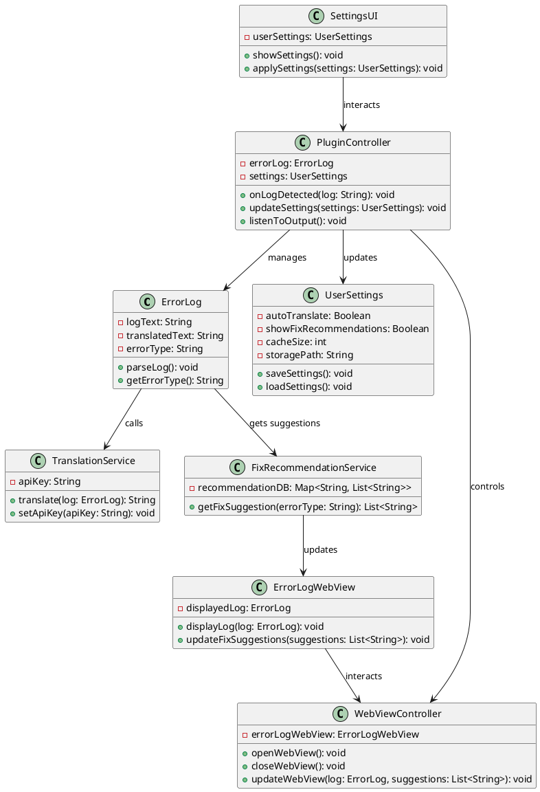
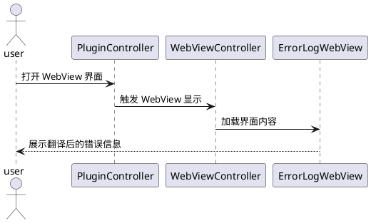
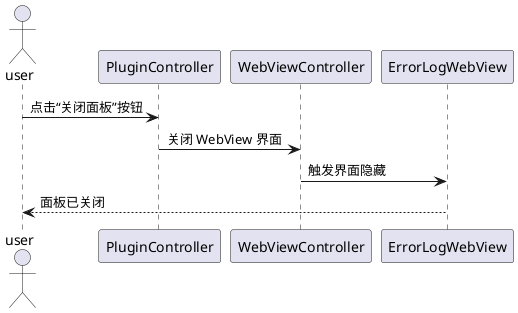
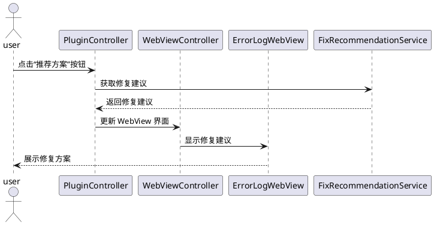
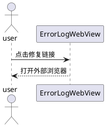
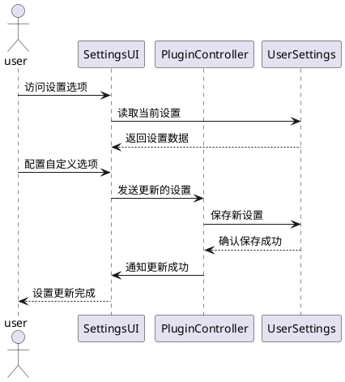
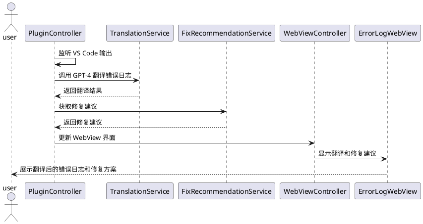

# 软件项目设计文档

## 类图

### 详细类图



## 顺序图

### 用况 1: 显示错误日志面板



### 用况 2: 关闭错误日志面板



### 用况 3: 提供智能修复方案



### 用况 4: 跳转到对应链接



### 用况 5: 配置设置选项



### 用况 6: 自动监听 VS Code 输出并翻译错误日志



## 项目介绍

vscode-error-log-plugin 是一个用于处理和分析错误日志的 VS Code 插件。它提供了一个用户友好的 WebView 界面，允许用户查看错误日志、获取翻译和修复建议。

## 目录结构

```
vscode-error-log-helper
├── .vscode                # VS Code 配置（可选）
├── src                    # 源代码目录
│   ├── views              # WebView UI 相关代码
│   ├── services           # 业务逻辑服务
│   ├── controllers        # 控制器
│   └── extension.js       # 插件入口
├── package.json           # 插件配置文件
├── README.md              # 项目说明
└── .gitignore             # Git 忽略文件
```

## 功能

- **错误日志解析**: 通过 `src/services/errorLog.js` 提供错误日志的解析功能。
- **翻译服务**: 使用 `src/services/translation.js` 调用 GPT-4 接口处理不同语言之间的转换。
- **修复建议**: 通过 `src/services/fixService.js` 分析错误并提供可能的解决方案。
- **用户设置管理**: `src/services/settings.js` 允许用户获取和更新配置。
- **WebView 界面**: `src/views/webview.js` 提供与 VS Code 的交互，`src/views/webview.html` 定义界面结构，`src/views/styles.css` 负责样式。
- **自动监听 VS Code 输出**: `src/controllers/pluginController.js` 实现监听 VS Code 输出日志，自动翻译错误日志并提供修复建议。

## 使用说明

1. 将插件克隆到本地。
2. 在 VS Code 中打开插件目录。
3. 按 `F5` 启动插件开发主机。
4. 在新打开的窗口中使用插件。
5. 插件会自动监听 VS Code 输出日志，翻译错误信息并提供修复建议。

## 开发

- 使用 Node.js 和 npm 管理依赖。
- 运行 `npm install` 安装依赖。
- 运行 `npm run build` 构建项目。
- 在 `src/config/config.js` 中设置 GPT-4 API Key。

## 贡献

欢迎提交问题和拉取请求！请确保遵循项目的贡献指南。

## 许可证

本项目遵循 MIT 许可证。
