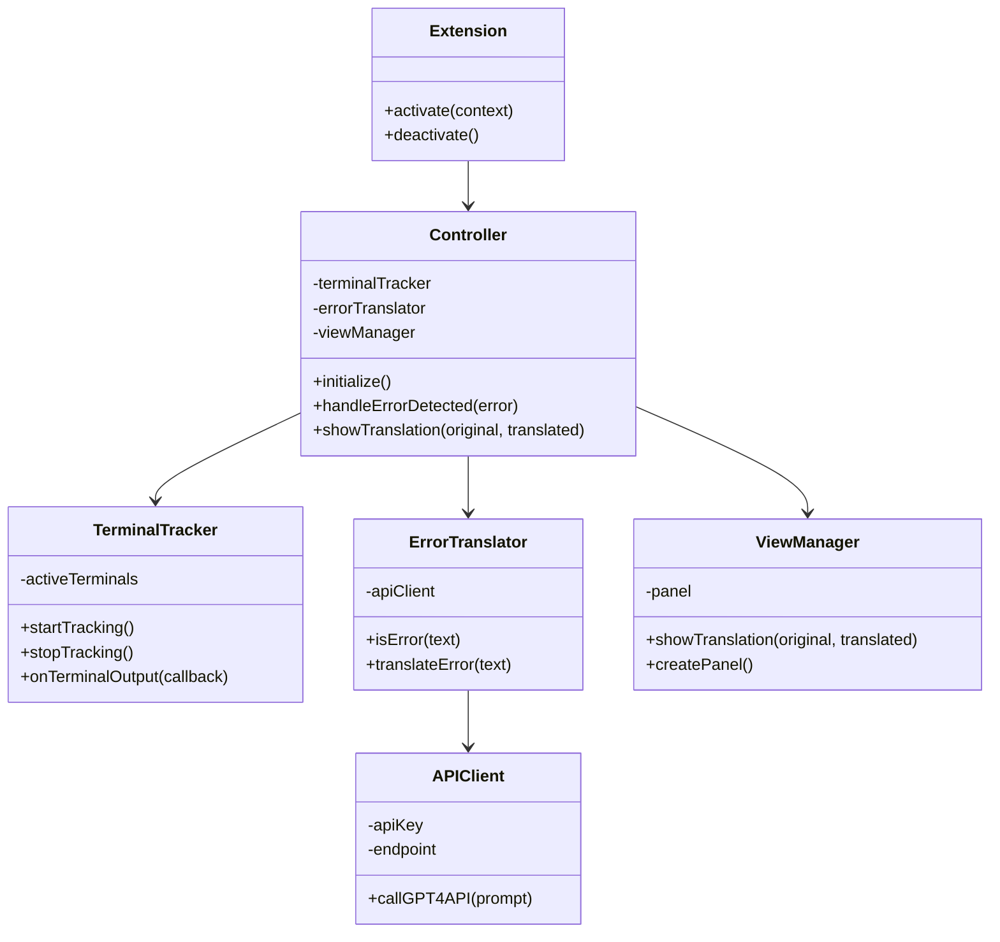

明白了，我将重新设计一个更简洁的MVC三层架构，使用最小化的范围，并将extension.js放在根目录。



```plaintext
error-translator-extension/
│
├── extension.js                  // 扩展入口点
│
├── src/
│   ├── controller/
│   │   └── controller.js         // 控制器层
│   │
│   ├── model/
│   │   ├── terminalTracker.js    // 终端监听模型
│   │   ├── errorTranslator.js    // 错误翻译模型
│   │   └── apiClient.js          // API客户端
│   │
│   └── view/
│       └── viewManager.js        // 视图管理
│
└── package.json                  // 扩展元数据和依赖项

```

这个设计采用了严格的MVC架构，并且减少了组件数量，专注于核心功能：

1. **Model层**:
   - `terminalTracker.js`: 监听VS Code终端输出
   - `errorTranslator.js`: 识别错误并处理翻译逻辑
   - `apiClient.js`: 与GPT-4 API交互

2. **View层**:
   - `viewManager.js`: 管理显示翻译结果的界面

3. **Controller层**:
   - `controller.js`: 协调模型和视图之间的交互

4. **扩展入口**:
   - `extension.js`: 放在根目录，负责扩展激活和注册

这个结构保持了最小的范围，专注于实现核心功能：监听终端错误 -> 翻译错误 -> 显示结果，没有添加额外的功能需求。